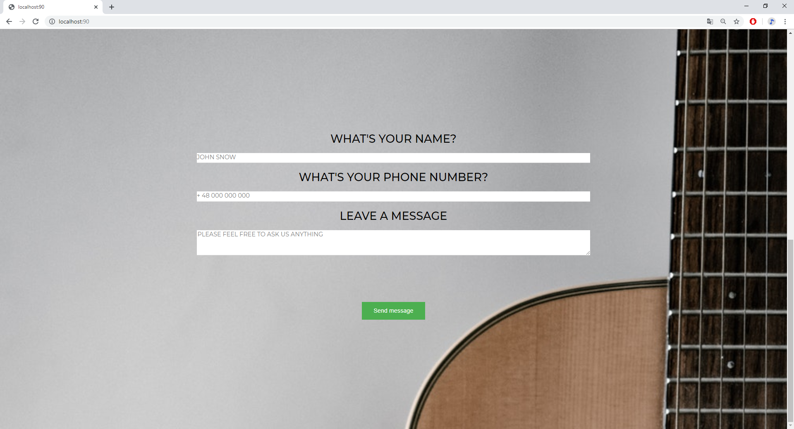

# GuitarFix - form

It' simple example MVC in Node using express.js.

## Packages

```bash
$ npm install
```

## Run
```bash
$ npm start
```

## Views
##### ***About:***

##### ***Contact:***


## Usage
```bash
$ node server.mjs
```

If you want to use your authentication you should create:
```$xslt
$ touch .env
```

and enter your login details there.
```
#Credentials
EMAIL = test@gmail.com
PASSWORD = test

#Data
FROM = test1@wp.pl
TO = test2@wp.pl
```

