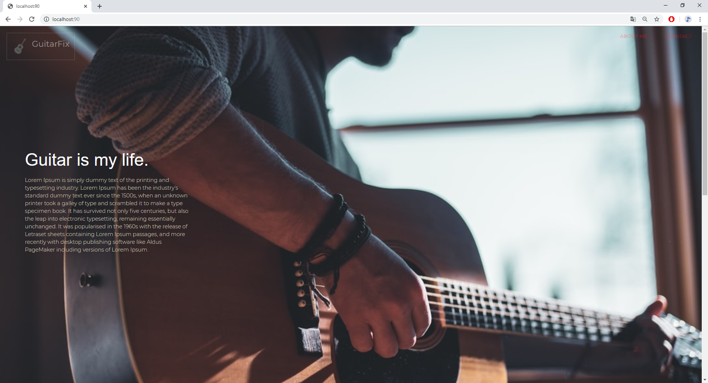
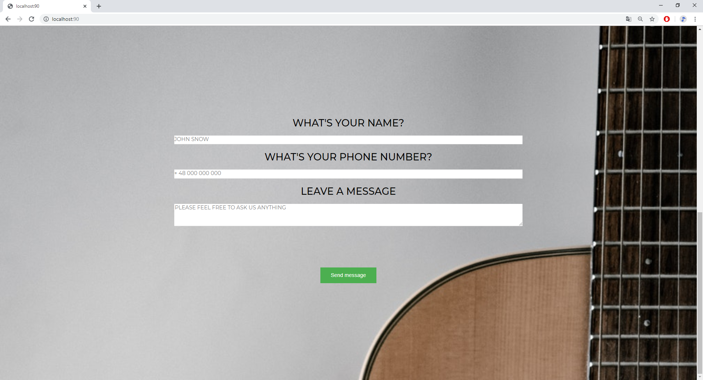

#GuitarFix - form

It' simple example MVC in Node using express.js.

##Packages

```bash
$ npm install dotenv
```
```
$ npm install express
```
```
$ npm install nodemailer
```
```
$ npm install pug
```

##Views
#####***About:***

#####***Contact:***


##Usage
```bash
$ node server.js
```

If you want to use your authentication you should create:
```$xslt
$ touch .env
```

and enter your login details there.
```
PASSWORD = XXXXXXX
EMAIL = XXXXXXXXX
```
You also should change  ****formController.js**** 
test email on your email
```javascript
let mailOptions = {
    from: 'test1@gmail.com',//Change
    to: 'test2@gmail.com',//Change
    subject: `${req.body.name} ${req.body.phone}`,
    body: req.body.message
};
```
